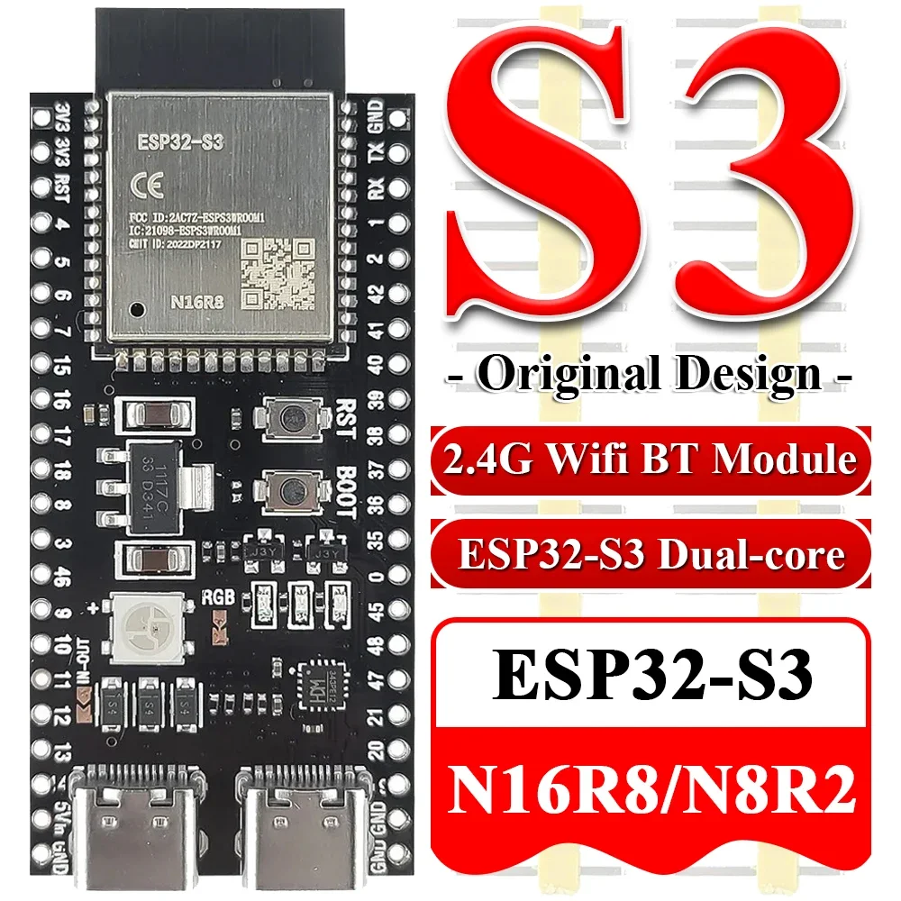
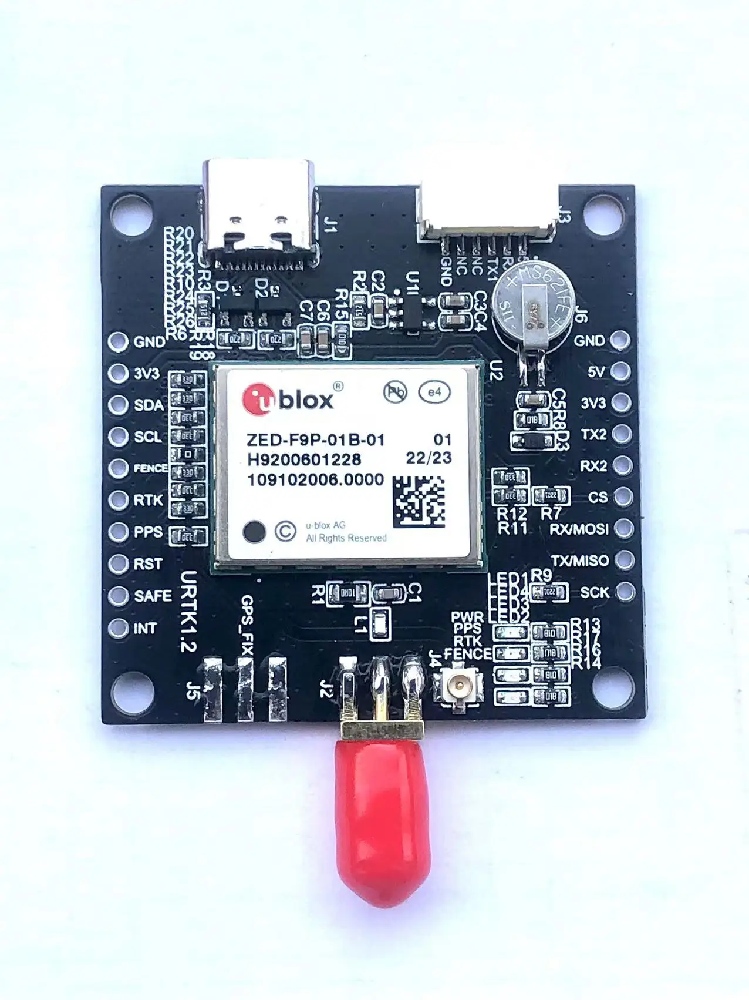
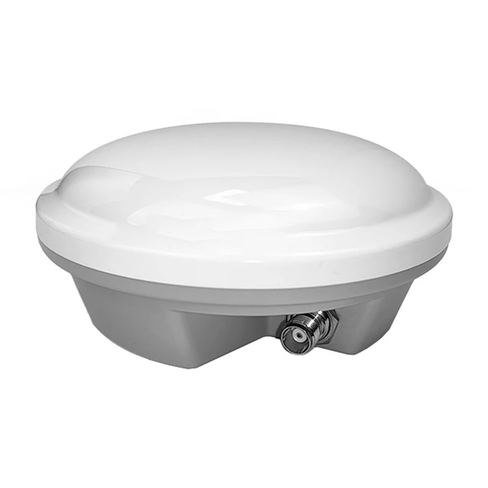

# RTK Rover and Station

PlatformIO firmware for ESP32-S3 + u-blox ZED-F9P providing centimeter-level GNSS positioning. One codebase, two compile-time modes:

- **Stationary (Base Station)** -- uses a known fixed position (or survey-in) to generate RTCM corrections broadcast to one or more NTRIP casters simultaneously, while publishing position metrics via MQTT.
- **Rover (Mobile Unit)** -- receives NTRIP RTK corrections and feeds them to the ZED-F9P for cm-level accuracy. Supports pluggable display drivers.

Both modes share: ZED-F9P I2C driver, multi-AP WiFi manager, NTP sync, MQTT telemetry, and NeoPixel status LED.

## Hardware

| Component | Module | Link |
|-----------|--------|------|
| MCU | ESP32-S3-WROOM1 N16R8 Dev Board | [](https://www.aliexpress.com/item/1005006418608267.html) |
| GNSS | ZED-F9P Development Board (I2C, SDA=GPIO 8, SCL=GPIO 9, 400 kHz) | [](https://www.aliexpress.com/item/1005007991451892.html) |
| Antenna | Multi-band GNSS Antenna (L1/L2/L5, GPS/Galileo/GLONASS/BeiDou) | [](https://www.aliexpress.com/item/1005006699317206.html) |
| Status LED | Onboard NeoPixel on GPIO 48 | -- |

## Quick Start

### 1. Clone and configure secrets

```bash
git clone https://github.com/olivernadj/rtk-rover-and-station.git
cd rtk-rover-and-station
cp src/secrets.h.example src/secrets.h
cp src/secrets.cpp.example src/secrets.cpp
```

Edit `src/secrets.cpp` with your WiFi credentials, MQTT broker, and NTRIP caster details.

You also need to copy the config file:
```bash
cp src/config.h.example src/config.h
```
Edit `src/config.h` to set your base station coordinates and other site-specific constants.

### 2. Build and flash

```bash
pio run -e stationary -t upload   # Base station
pio run -e rover -t upload        # Rover
pio device monitor --baud 115200  # Serial monitor
```

## Architecture

Mode is selected at compile time via `build_flags` in `platformio.ini` (`-D MODE_STATIONARY` or `-D MODE_ROVER`). Mode-specific code is guarded with `#ifdef`.

**Design pattern:** Cooperative multitasking in Arduino `loop()`. Each module exposes a non-blocking `update()` call. Reconnections use `Ticker` one-shot timers.

### Data flow

```
                    Both modes
                    ----------
ZED-F9P (I2C) --> gnss.cpp --> metrics.cpp --> mqtt_manager.cpp --> MQTT broker

                    Stationary only
                    ----------------
ZED-F9P (RTCM) --> gnss.cpp (processRTCM callback) --> ntrip_broadcaster.cpp --> NTRIP caster(s)

                    Rover only
                    ----------
NTRIP caster --> ntrip_client.cpp --> ZED-F9P (pushRawData)
```

### Source files

| File | Mode | Purpose |
|------|------|---------|
| `main.cpp` | both | Setup + cooperative loop |
| `config.h` | both | Compile-time constants |
| `secrets.h` / `.cpp` | both | Credentials (gitignored) |
| `gnss.h` / `.cpp` | both | ZED-F9P I2C driver; stationary enables RTCM output via `processRTCM` callback |
| `metrics.h` / `.cpp` | both | JSON payload formatter (stack buffer, no heap) |
| `wifi_manager.h` / `.cpp` | both | Multi-AP WiFi with Ticker reconnect |
| `mqtt_manager.h` / `.cpp` | both | AsyncMqttClient wrapper with Ticker reconnect |
| `status_led.h` / `.cpp` | both | NeoPixel blink state machine |
| `ntrip_broadcaster.h` / `.cpp` | stationary | NTRIP v1 SOURCE protocol, simultaneous multi-caster RTCM broadcast |
| `ntrip_client.h` / `.cpp` | rover | NTRIP correction client |
| `display.h` | rover | `IDisplay` abstract interface + `NullDisplay` default |
| `logger.h` | both | Header-only dual-backend logging (Serial + MQTT) |
| `ota_updater.h` / `.cpp` | both (opt-in) | Poll-based OTA firmware updater (requires `-D OTA_ENABLED`) |

## Configuration

All compile-time constants live in `src/config.h`: I2C pins, GPS sample interval, MQTT topic, NTRIP timeouts, LED timing, buffer sizes, and fixed base station coordinates.

### Secrets

`secrets.h` declares extern symbols; `secrets.cpp` defines the values. This split avoids multiple-definition linker errors.

**Stationary secrets:** WiFi credentials, MQTT broker, `NtripCasterConfig NTRIP_CASTERS[]` array (host, port, mountpoint, user, password -- one entry per caster).

**Rover secrets:** WiFi credentials, MQTT broker, single NTRIP caster fields.

**OTA secrets** (when `OTA_ENABLED`): `OTA_USER` and `OTA_PASSWORD` for HTTP Basic Auth against your OTA server.

### Fixed position vs. survey-in

Set `USE_FIXED_POSITION = true` in `config.h` to skip survey-in and use known coordinates (recommended for permanent installations). Coordinates use ZED-F9P raw units: lat/lon in degrees x 10^-7, altitude in mm above ellipsoid.

Example (Stonehenge):
```cpp
constexpr int32_t  FIXED_LAT     = 511788630;   // 51.1788630°
constexpr int32_t  FIXED_LON     = -18262170;   // -1.8262170°
constexpr int32_t  FIXED_ALT_MM  = 102000;      // 102.000 m
```

## Status LED

Blink burst every 5 seconds, highest priority first:

| Pattern | Meaning |
|---------|---------|
| Red 2x | GNSS I2C error |
| Red 1x | WiFi disconnected |
| Yellow 1x | NTP not synced |
| Yellow 2x | NTRIP down |
| Yellow 3x | MQTT down |
| Blue 1x | All systems OK |

Status is also printed to serial every 5 seconds:
```
[STATUS] OK (wifi=1 gnss=1 ntp=1 mqtt=1 ntrip=1)
```

## MQTT Metrics

Published to `mqtt/metrics/v2` as JSON:

```json
{"metric_type":"gauge","samples":{"lat":"511788630","lat_hp":"42","long":"-18262170","long_hp":"-15","alt":"102000","corr_age":"0","siv":"24","fix_type":"3","carr_soln":"2","wifi_rssi":"-52","corr_count":"142"},"timestamp":1775400000,"client":"rtk-stationary","labels":{"device":"esp32s3-74696F","mode":"stationary","fw_version":"0.12.1","wifi_ssid":"MyNetwork","project":"GPS"}}
```

| Field | Location | Description |
|-------|----------|-------------|
| `lat`, `long` | samples | degrees x 10^-7 (e.g. 511788630 = 51.1788630) |
| `lat_hp`, `long_hp` | samples | high-precision digits (x 10^-9, int8 range) |
| `alt` | samples | mm above ellipsoid |
| `corr_age` | samples | Stationary: seconds since last RTCM push to caster. Rover: seconds since last RTK-corrected position |
| `siv` | samples | Satellites in view |
| `fix_type` | samples | 0=none, 3=3D, 5=time-only |
| `carr_soln` | samples | 0=none, 1=float RTK, 2=fixed RTK |
| `wifi_rssi` | samples | WiFi signal strength in dBm |
| `corr_count` | samples | Monotonic counter of RTCM corrections sent (stationary) or received (rover) |
| `device` | labels | Hostname (MAC-derived, e.g. esp32s3-314A2C) |
| `mode` | labels | "stationary" or "rover" |
| `fw_version` | labels | Firmware version from CHANGELOG.md |
| `wifi_ssid` | labels | Connected WiFi access point name |

## Adding a Display Driver (Rover)

1. Create `src/display_<name>.h` subclassing `IDisplay` from `src/display.h`
2. Implement `void init()` and `void update(const GnssData& data)`
3. In `src/main.cpp`, replace `NullDisplay` with your driver instance

## OTA (Over-The-Air) Updates

OTA is opt-in. Add `-D OTA_ENABLED` to `build_flags` in `platformio.ini` to enable it. Without this flag, zero OTA code is compiled.

When enabled, the device polls a manifest URL every 5 minutes over HTTPS with Basic Auth. If the firmware version has changed, it streams the new binary directly to flash using an internal SRAM IO buffer, shuts down WiFi to ensure exclusive SPI bus access, verifies the image hash, and reboots automatically.

Configure the server URL in `src/config.h` and credentials in `src/secrets.cpp`. See [docs/OTA.md](docs/OTA.md) for full instructions on setting up your own OTA server.

## Measured Accuracy

Tested 2026-04-08 with rover antenna stationary, ~261 cm from the base station antenna. 74 samples over 20 minutes, RTK Fixed (carr_soln=2) 100% of the time, 30--32 satellites, correction age 0s.

### Horizontal (relative to mean position)

| Metric | Value |
|--------|-------|
| Std dev (2D) | 0.34 cm |
| CEP50 (50% of points within) | 0.26 cm |
| CEP95 (95% of points within) | 0.63 cm |
| Max error | 0.70 cm |

### Vertical (relative to mean altitude)

| Metric | Value |
|--------|-------|
| Std dev | 0.64 cm |
| 95th percentile | 1.34 cm |
| Max error | 2.06 cm |
| Total range | 3.6 cm |

Sub-centimeter horizontal precision, ~1.3 cm vertical (95%). Vertical error is roughly 2x horizontal, which is typical for GNSS.

## Dependencies

| Library | Version |
|---------|---------|
| [SparkFun u-blox GNSS v3](https://github.com/sparkfun/SparkFun_u-blox_GNSS_v3) | >= 3.1.13 |
| [AsyncMqttClient](https://github.com/marvinroger/async-mqtt-client) | >= 0.9.0 |
| [Adafruit NeoPixel](https://github.com/adafruit/Adafruit_NeoPixel) | >= 1.12.0 |

## License

MIT
